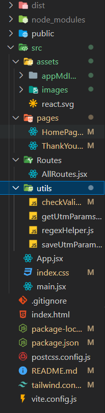
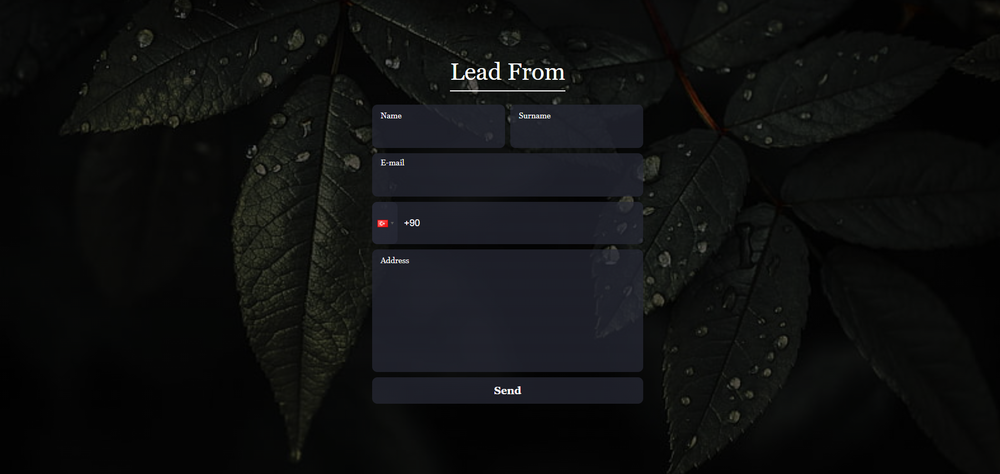
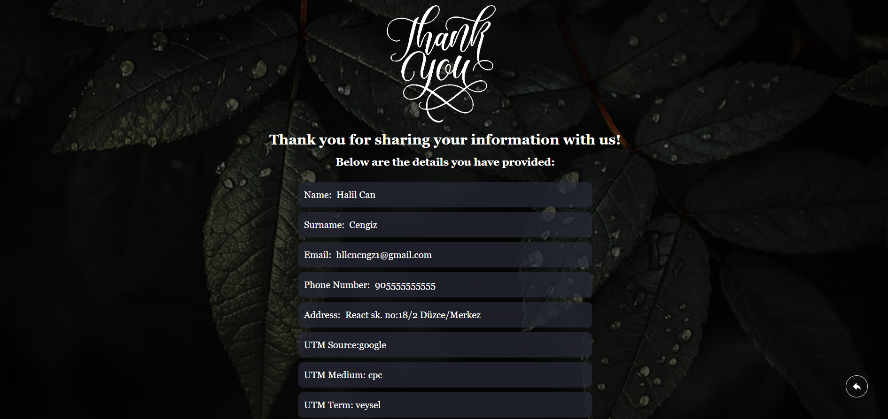

<h3 style="text-align:center;text-transform:capitalize">--Kullanılan Teknolojiler ve Kütüphaneler--</h3>
<ul style="display:flex;flex-wrap:wrap;justify-content:center">
<li style="list-style-type:none;display:flex;align-items:center;margin-top:10px;">

Javascript
</li>
<li style="list-style-type:none;display:flex;align-items:center;margin-top:10px;">

ReactJS
</li>
<li style="list-style-type:none;display:flex;align-items:center;margin-top:10px;">

React Hot Toast
</li>
<li style="list-style-type:none;display:flex;align-items:center;margin-top:10px;">

React Router
</li>
</ul>

<h3 style="text-align:center;text-transform:capitalize;margin:10px">--Uygulama Açıklama--</h3>

Utm parametrelerini url de yakalayıp localstorage a kaydediyor. Form alanında gerekli validasyon işlemleri yapıldıktan sonra eğer bir sorun yoksa /thank-you-page sayfasına yönlendiriliyor. En sonunda girilen utm parametreleri ve form bilgileri ekranda gösteriliyor.

<h3 style="text-align:center;text-transform:capitalize;margin:10px">--Dosya Yapısı--</h3>

<h3 style="text-align:center;text-transform:capitalize;margin:10px">--Uygulama İçi Görüntüler--</h3>

